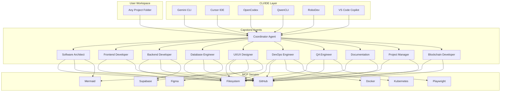
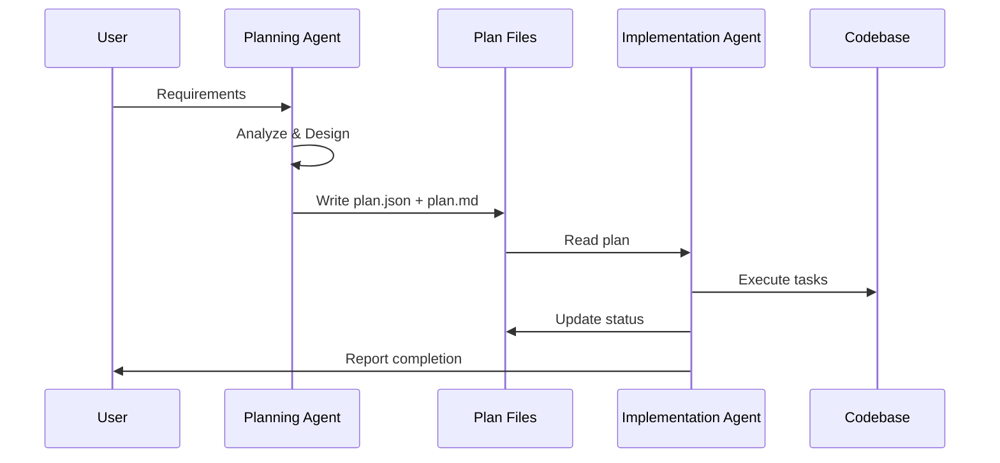
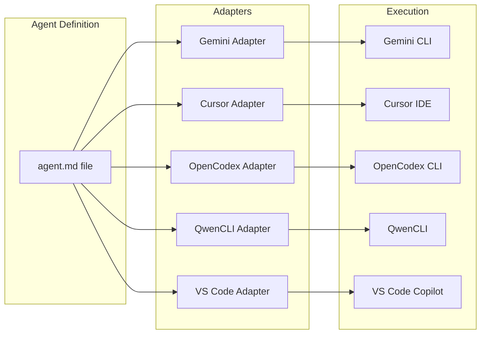

# Capstone Agents Architecture

This document describes the architecture of the Capstone Agents repository, a modular, workspace-agnostic AI agent system for software development.

## Overview

Capstone Agents is designed to simulate a complete software development team using AI agents. Each agent represents a real-world role and can operate independently or collaboratively within any project workspace.



## Repository Structure

```
capstone-agents/
├── agents/                    # Agent definitions (Markdown)
│   ├── coordinator/           # Project coordination
│   ├── software-architect/    # System design
│   ├── frontend/              # UI development
│   ├── backend/               # API development
│   ├── database-engineer/     # Database design
│   ├── designer/              # UI/UX design
│   ├── devops/                # Infrastructure
│   ├── qa/                    # Testing
│   ├── documentation/         # Technical writing
│   ├── project-manager/       # Project tracking
│   └── blockchain/            # Smart contracts
│
├── .mcp/                      # MCP server configurations
│   ├── filesystem.json
│   ├── github.json
│   ├── mermaid.json
│   ├── plantuml.json
│   └── ... (17 total)
│
├── scripts/                   # Automation (Python + Bash)
│   ├── run_agents.py          # Multi-agent runner
│   ├── generate-agent.py      # Agent scaffolding
│   ├── validate-agent.py      # Agent validation
│   └── setup_vscode_copilot.py
│
├── integration/               # CLI/IDE integration guides
│   ├── gemini/
│   ├── cursor-cli/
│   ├── cursor-ide/
│   ├── opencodex/
│   ├── qwencli/
│   ├── robodev/
│   ├── copilot/
│   └── vscode-copilot/
│
└── docs/                      # Documentation
```

## Dual-Layer Agent Architecture

Each agent role has two layers:

### Planning Agent
- **Purpose**: Analyze requirements, design solutions, create implementation plans
- **Output**: `{role}-plan.md` and `{role}-plan.json`
- **Behavior**: Read-only on codebase, writes plans only

### Implementation Agent
- **Purpose**: Execute the plan, write code, produce artifacts
- **Input**: Plan files from Planning Agent
- **Behavior**: Reads plan, modifies codebase, updates plan status



## Agent Communication Protocol

Agents communicate through the filesystem using structured files:

### Plan File Format (JSON)
```json
{
  "role": "frontend",
  "version": "1.0",
  "created": "2025-11-27T10:00:00Z",
  "tasks": [
    {
      "id": "task-1",
      "description": "Create login component",
      "dependencies": [],
      "status": "pending",
      "assignee": "frontend-implementation"
    }
  ],
  "outputs": [],
  "notes": []
}
```

### Status Values
- `pending` - Not started
- `in-progress` - Currently being worked on
- `completed` - Successfully finished
- `blocked` - Waiting on dependency
- `failed` - Encountered error

## MCP Integration Layer

The Model Context Protocol (MCP) provides agents with access to external tools:

| Category | MCP Servers | Purpose |
|----------|-------------|---------|
| **Core** | filesystem, github | File operations, version control |
| **Database** | supabase, postgres | Database operations |
| **Design** | figma, excalidraw | Design access, wireframing |
| **Diagrams** | mermaid, plantuml | Visual documentation |
| **DevOps** | docker, kubernetes | Container orchestration |
| **Testing** | playwright, puppeteer | Browser automation |
| **Utilities** | memory, fetch, time | Persistence, HTTP, scheduling |
| **Communication** | slack, sentry | Team chat, error tracking |
| **Reasoning** | sequential-thinking | Complex decision chains |

## CLI/IDE Compatibility Layer

Agents are designed to work across multiple environments:



### Adapter Responsibilities
1. Load agent Markdown as system prompt
2. Configure MCP tool access
3. Handle input/output formatting
4. Manage session state

## Workspace Agnostic Design

Key principles that enable workspace independence:

1. **Relative Paths Only**: Agents never assume absolute paths
2. **No Hardcoded Structure**: Agents discover project structure dynamically
3. **Portable Plans**: Plan files use relative references
4. **Environment Detection**: Scripts detect available tools at runtime

## Security Considerations

- MCP servers run with user-level permissions
- API keys stored in `.env` (not committed)
- Agents cannot execute arbitrary shell commands by default
- File access limited to workspace scope

## Extending the System

### Adding a New Agent
1. Run `python scripts/generate-agent.py`
2. Edit the generated files in `agents/{role}/`
3. Run `python scripts/validate-agent.py .` to verify

### Adding a New MCP Server
1. Create config in `.mcp/{server}.json`
2. Update relevant agent files to include the tool
3. Document in `docs/mcp-integration-guide.md`

### Adding a New CLI Integration
1. Create folder in `integration/{cli-name}/`
2. Add README.md with setup instructions
3. Update `scripts/run_agents.py` with new CLI handler
