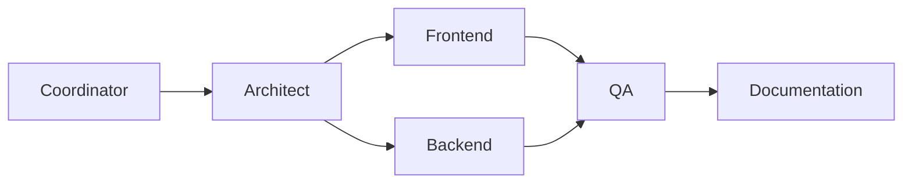
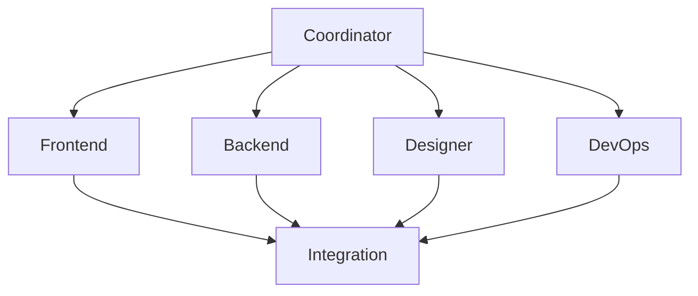
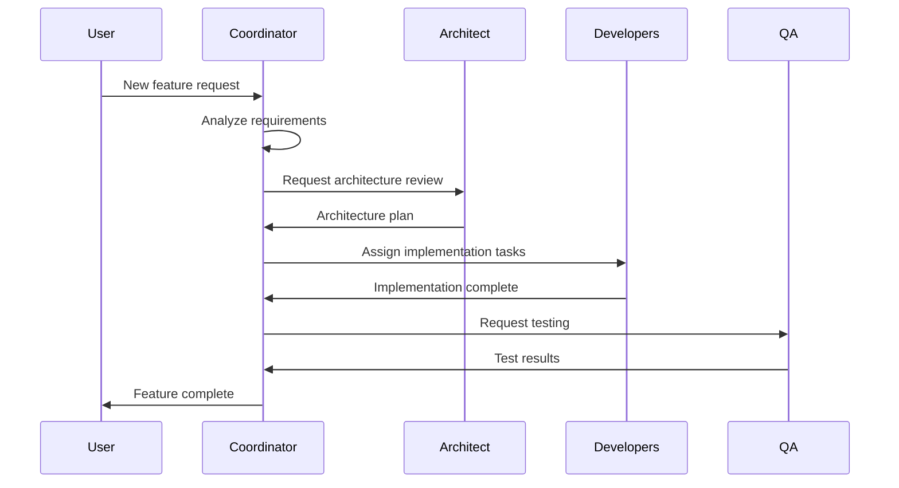
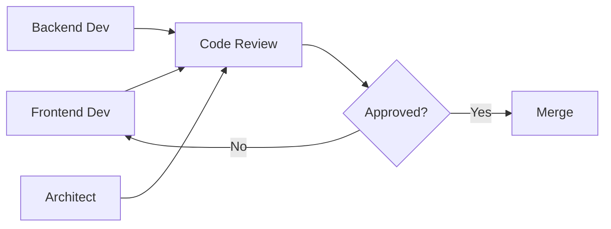

# Multi-Agent Workflows

This guide explains how to coordinate multiple agents to accomplish complex software development tasks.

## Workflow Patterns

### 1. Sequential Workflow

Agents execute one after another, each building on the previous agent's output.



**Use Case**: Greenfield project development

**Example**:
```bash
# Step 1: Coordinator creates project plan
python scripts/run_agents.py --cli vscode --agents coordinator

# Step 2: Architect designs system
python scripts/run_agents.py --cli vscode --agents software-architect

# Step 3: Parallel development
python scripts/run_agents.py --cli vscode --agents frontend backend

# Step 4: QA testing
python scripts/run_agents.py --cli vscode --agents qa

# Step 5: Documentation
python scripts/run_agents.py --cli vscode --agents documentation
```

---

### 2. Parallel Workflow

Multiple agents work simultaneously on independent tasks.



**Use Case**: Feature development with clear boundaries

**Example**:
```bash
# Run all planning agents in parallel
python scripts/run_agents.py --agents frontend backend designer devops --cli gemini
```

---

### 3. Coordinator-Led Workflow

The Coordinator agent orchestrates all other agents, making decisions about task assignment.



**Use Case**: Complex projects requiring oversight

---

### 4. Review Workflow

Agents review each other's work for quality assurance.



**Use Case**: Code quality enforcement

---

### 5. Universal Context Mode (Dynamic Switching)

With `scripts/run_agents.py`, you can enable **Universal Context Mode**, which loads *all* agent definitions into the context window at once. This allows you to dynamically switch between agents during an interactive session using `@` mention triggers.

**Enable with:** `--context-mode multi` (Default for interactive sessions `-i`)

**Usage**:
1. Start an interactive session:
   ```bash
   python scripts/run_agents.py -i
   ```
2. In the chat, invoke any agent:
   > @coordinator, please create a plan for...
   > @frontend, implement the login page based on the plan.

**Supported CLIs**:
This works with **ALL** supported CLIs (Gemini, Cursor, Copilot, Qwen, etc.).

---

## Example: Full-Stack Feature Development

### Scenario
Add a user authentication feature with login, registration, and password reset.

### Step 1: Project Initialization

```bash
# Coordinator analyzes requirements
python scripts/run_agents.py --agents coordinator --cli vscode
```

**Coordinator Output** (`coordinator-plan.json`):
```json
{
  "role": "coordinator",
  "feature": "User Authentication",
  "tasks": [
    {"id": "arch-1", "assignee": "software-architect", "task": "Design auth architecture"},
    {"id": "db-1", "assignee": "database-engineer", "task": "Design user schema"},
    {"id": "be-1", "assignee": "backend", "task": "Implement auth API", "depends": ["arch-1", "db-1"]},
    {"id": "fe-1", "assignee": "frontend", "task": "Build login/register UI", "depends": ["be-1"]},
    {"id": "qa-1", "assignee": "qa", "task": "Test auth flows", "depends": ["fe-1", "be-1"]}
  ]
}
```

### Step 2: Architecture & Database Design (Parallel)

```bash
python scripts/run_agents.py --agents software-architect database-engineer --cli gemini
```

**Architect Output** (`software-architect-plan.md`):
```markdown
## Authentication Architecture

### Components
- JWT-based authentication
- Refresh token rotation
- Password hashing with bcrypt

### Sequence Diagram
​```mermaid
sequenceDiagram
    Client->>API: POST /auth/login
    API->>DB: Validate credentials
    DB->>API: User data
    API->>API: Generate JWT
    API->>Client: {token, refreshToken}
​```
```

**Database Engineer Output** (`database-engineer-plan.md`):
```markdown
## User Schema

​```sql
CREATE TABLE users (
  id UUID PRIMARY KEY DEFAULT gen_random_uuid(),
  email VARCHAR(255) UNIQUE NOT NULL,
  password_hash VARCHAR(255) NOT NULL,
  created_at TIMESTAMP DEFAULT NOW(),
  updated_at TIMESTAMP DEFAULT NOW()
);

CREATE TABLE refresh_tokens (
  id UUID PRIMARY KEY,
  user_id UUID REFERENCES users(id),
  token VARCHAR(255) NOT NULL,
  expires_at TIMESTAMP NOT NULL
);
​```
```

### Step 3: Backend Implementation

```bash
python scripts/run_agents.py --agents backend --cli cursor
```

The Backend agent reads the architecture and database plans, then implements:
- `/auth/register` - User registration
- `/auth/login` - User login
- `/auth/refresh` - Token refresh
- `/auth/logout` - Session termination

### Step 4: Frontend Implementation

```bash
python scripts/run_agents.py --agents frontend --cli cursor
```

The Frontend agent builds:
- Login form component
- Registration form component
- Password reset flow
- Auth context/state management

### Step 5: QA Testing

```bash
python scripts/run_agents.py --agents qa --cli vscode
```

The QA agent creates test cases:
- Unit tests for auth utilities
- Integration tests for API endpoints
- E2E tests for login/register flows

### Step 6: Documentation

```bash
python scripts/run_agents.py --agents documentation --cli vscode
```

The Documentation agent produces:
- API documentation
- User guide for authentication
- Developer setup instructions

---

## Agent Communication

### Plan File Handoff

Agents communicate through plan files in the workspace:

```
workspace/
├── coordinator-plan.json      # Master project plan
├── coordinator-plan.md
├── software-architect-plan.json
├── software-architect-plan.md
├── database-engineer-plan.json
├── database-engineer-plan.md
├── backend-plan.json
├── backend-plan.md
├── frontend-plan.json
├── frontend-plan.md
└── qa-plan.json
```

### Status Updates

Each agent updates its plan status:

```json
{
  "tasks": [
    {
      "id": "task-1",
      "status": "completed",
      "completedAt": "2025-11-27T15:30:00Z",
      "output": "src/components/LoginForm.tsx"
    }
  ]
}
```

### Dependency Resolution

Agents check dependencies before starting:

```python
# In agent logic
def can_start(task, all_plans):
    for dep_id in task.dependencies:
        dep_task = find_task(dep_id, all_plans)
        if dep_task.status != "completed":
            return False
    return True
```

---

## Best Practices

### 1. Start with Coordinator
Always begin with the Coordinator agent to establish the project plan.

### 2. Use Planning Agents First
Run planning agents before implementation agents to ensure alignment.

### 3. Check Dependencies
Before running an implementation agent, verify its dependencies are complete.

### 4. Review Intermediate Outputs
Check plan files between agent runs to catch issues early.

### 5. Use Parallel Execution Wisely
Only parallelize agents with no dependencies on each other.

### 6. Document Decisions
Use the Documentation agent to capture architectural decisions and rationale.

---

## Troubleshooting

### Agent Produces Unexpected Output

1. Check if dependencies are complete
2. Verify the input plan files are valid JSON
3. Review the agent's MCP tool access

### Dependency Deadlock

If agents are waiting on each other:
1. Review the dependency graph for cycles
2. Break the cycle by having Coordinator reassign tasks

### Inconsistent Plans

If agent outputs conflict:
1. Run the Coordinator to resolve conflicts
2. Have the Architect review for consistency
3. Update plans manually if needed
