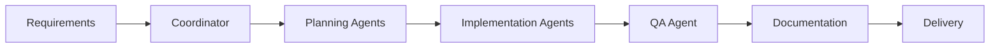

# Usage Guide

This guide covers everything you need to know to effectively use Capstone Agents in your software development workflow.

## Quick Start

```bash
# 1. Clone and enter the repository
git clone https://github.com/your-org/capstone-agents.git
cd capstone-agents

# 2. Set up environment variables
cp .env.example .env
# Edit .env with your API keys

# 3. List available agents
python scripts/run_agents.py -l

# 4. Run an agent interactively on your project
python scripts/run_agents.py -a coordinator -w /path/to/your/project -i
```

---

## Command Cheatsheet

### Quick Reference

```bash
# List all agents
python scripts/run_agents.py -l

# Interactive planning session (recommended)
python scripts/run_agents.py -a <agent> -w <workspace> -i

# Universal Agent Mode (Unified Planning & Implementation)
python scripts/run_agents.py -a <agent> -w <workspace> -i

# Legacy Mode (Split Agents)
python scripts/run_agents.py -a <agent> -w <workspace> --legacy -t impl -i

# Batch mode
python scripts/run_agents.py -a <agent> -w <workspace>

# Test mode
python scripts/run_agents.py -a <agent> -c test
```

### Full Command Reference

| Flag | Long Form | Description | Default |
|------|-----------|-------------|--------|
| `-a` | `--agent` | Agent to run (designer, frontend, etc.) | coordinator |
| `-w` | `--workspace` | Path to your project | `.` (current) |
| `-c` | `--cli` | CLI tool (`gemini`, `cursor`, `cursor-ide`, `codex`, `claude`, `copilot-cli`, `vscode`, `test`) | gemini |
| `-i` | `--interactive` | Stay open for conversation | off |
| `-t` | `--type` | Agent type (planning, impl) | planning |
| `-l` | `--list` | List available agents | — |
| `--legacy` | `--legacy` | Use legacy split agents (planning/implementation) | off |
| `--auto-approve` | `--auto-approve` | Allow batch runs to execute tools or modify the workspace without interactive confirmation (use with caution) | off |

### Agent Type Values (Legacy Mode Only)

| Value | Loads |
|-------|-------|
| `planning`, `plan`, `p` | `*-planning.md` |
| `implementation`, `impl`, `i` | `*-implementation.md` |

### Examples by Workflow

```bash
# 1. Start designer agent (handle both planning & impl)
python scripts/run_agents.py -a designer -w ~/my-app -i

# 2. Start legacy implementation agent
python scripts/run_agents.py -a designer -w ~/my-app -i --legacy -t impl
```

### Using Bash Scripts

```bash
# Make scripts executable (first time)
chmod +x scripts/*.sh

# Launch single agent (interactive)
./scripts/launch-agent.sh designer /path/to/project gemini

# Launch implementation agent
./scripts/launch-agent.sh designer /path/to/project gemini impl
```

---

## Agent Roles Overview

| Role | Unified Agent | Legacy Planning | Legacy Impl | Primary Purpose |
|------|:-------------:|:---------------:|:-----------:|-----------------|
| **Coordinator** | ✅ | ✅ | — | Project planning, delegation |
| **Software Architect** | ✅ | ✅ | ✅ | System design, tech stack |
| **Frontend Developer** | ✅ | ✅ | ✅ | UI implementation |
| **Backend Developer** | ✅ | ✅ | ✅ | API & Server logic |
| **Database Engineer** | ✅ | ✅ | ✅ | Schema & Queries |
| **UI/UX Designer** | ✅ | ✅ | ✅ | Wireframes & Design System |
| **DevOps Engineer** | ✅ | ✅ | ✅ | CI/CD & Infrastructure |
| **QA Engineer** | ✅ | ✅ | ✅ | Testing & Bugs |
| **Documentation** | ✅ | ✅ | ✅ | Technical writing |
| **Project Manager** | ✅ | ✅ | ✅ | Timeline & Milestones |
| **Blockchain Developer**| ✅ | ✅ | ✅ | Smart Contracts |

---

## Running Agents

### Interactive Mode (Recommended)

Interactive mode keeps the CLI session open so you can have a conversation with the agent:

```bash
# Run unified agent interactively (Recommended)
python scripts/run_agents.py -a designer -w /path/to/project -i

# Run legacy implementation agent interactively
python scripts/run_agents.py -a designer -w /path/to/project -i --legacy -t impl
```

### Single Agent (Bash)
To run a single agent using the bash wrapper:
```bash
./scripts/launch-agent.sh designer /path/to/project gemini
```

### Batch Mode
Batch mode auto-executes and exits (useful for CI/CD):
```bash
python scripts/run_agents.py -a backend -w /path/to/project
```

### Multiple Agents
To run multiple agents in parallel, use `run-agents.sh`:
```bash
./scripts/run-agents.sh --agents frontend backend designer
```

Or with Python:
```bash
python scripts/run_agents.py --agents frontend backend designer --cli cursor
```

### CLI Selection
You can specify which CLI tool to use with the `-c` flag:
```bash
python scripts/run_agents.py -a designer -c cursor -i
```

Supported CLIs:
- `gemini` — Google Gemini CLI (default)
- `cursor` — Cursor IDE/CLI
- `codex` — OpenAI Codex CLI
- `claude` — Anthropic Claude CLI
- `cursor-ide` — Opens the workspace in Cursor IDE with instructions to paste agent content
- `copilot-cli` — GitHub Copilot CLI; interactive runs auto-initialize the session with the selected agent's instructions
- `rovodev` — RovoDev CLI (Atlassian); agent instructions copied to clipboard for manual pasting
- `vscode` — VS Code (opens workspace with instructions)
- `test` — Test mode (dry run, no CLI invoked)

Note on batch safety:
- Batch runs that enable aggressive or programmatic tool access (for example: `gemini` with auto flags, `codex` full-auto, `copilot-cli` with `--allow-tool`, or `rovodev` programmatic actions) require explicit `--auto-approve` to prevent accidental destructive changes. When in doubt, run with `-i` (interactive) so actions are confirmed manually.

---

## Workflow

### Standard Development Flow



### Step-by-Step

1. **Planning Phase**
   - Coordinator analyzes project requirements
   - Creates master task breakdown
   - Assigns tasks to specialized agents

2. **Design Phase**
   - Software Architect designs system architecture
   - Database Engineer designs schema
   - Designer creates UI/UX wireframes

3. **Implementation Phase**
   - Frontend builds UI components
   - Backend implements API endpoints
   - DevOps sets up infrastructure

4. **Quality Phase**
   - QA writes and runs tests
   - Agents review each other's work
   - Bugs are logged and fixed

5. **Documentation Phase**
   - Technical Writer documents APIs
   - User guides are created
   - README is updated

---

## Output Files

Each agent produces output files in the workspace:

### Plan Files (JSON)

```json
{
  "role": "frontend",
  "version": "1.0",
  "created": "2025-11-27T10:00:00Z",
  "tasks": [
    {
      "id": "fe-task-1",
      "description": "Create login component",
      "status": "pending",
      "dependencies": ["be-task-1"]
    }
  ]
}
```

### Plan Files (Markdown)

```markdown
# Frontend Development Plan

## Overview
This plan outlines the frontend implementation strategy...

## Tasks

### 1. Create Login Component
- Build form with email/password fields
- Add validation
- Connect to auth API

### 2. Implement Dashboard
...
```

### Status Values

| Status | Description |
|--------|-------------|
| `pending` | Not yet started |
| `in-progress` | Currently being worked on |
| `completed` | Successfully finished |
| `blocked` | Waiting on a dependency |
| `failed` | Encountered an error |

---

## Agent Scripts

### `run_agents.py`

The main script for running agents.

```bash
# Basic usage
python scripts/run_agents.py --agents <agent_names> --cli <cli_tool>

# Examples
python scripts/run_agents.py --agents coordinator
python scripts/run_agents.py --agents frontend backend --cli cursor
python scripts/run_agents.py --agents qa --cli gemini --workspace /path/to/project
```

**Arguments**:
- `--agents`: Space-separated list of agent names
- `--cli`: CLI tool to use (default: gemini)
- `--workspace`: Path to workspace (default: current directory)

### `generate-agent.py`

Scaffold new agent files.

```bash
python scripts/generate-agent.py /path/to/workspace
```

### `validate-agent.py`

Validate agent file structure.

```bash
python scripts/validate-agent.py /path/to/workspace

# Expected output:
# PASS: agents/coordinator/coordinator.md
# PASS: agents/frontend/frontend-planning.md
# ...
# All agents validated successfully.
```

### `setup_vscode_copilot.py`

Configure VS Code for Copilot integration.

```bash
python scripts/setup_vscode_copilot.py /path/to/workspace
```

---

## Best Practices

### 1. Start with the Coordinator
Always begin your workflow with the Coordinator agent to establish a project plan.

### 2. Run Planning Before Implementation
Execute planning agents before their corresponding implementation agents.

### 3. Check Plan Files
Review generated plan files between agent runs to ensure alignment.

### 4. Use the Right CLI for the Task
- **Gemini/Cursor**: Best for complex reasoning tasks
- **OpenCodex**: Good for code generation
- **VS Code Copilot**: Best for iterative development

### 5. Validate Regularly
Run `validate-agent.py` after making changes to agent files.

---

## Troubleshooting

### "Agent not found"
```bash
# Check available agents
ls agents/

# Verify agent file exists
cat agents/frontend/frontend-planning.md
```

### "CLI not available"
```bash
# Check CLI installation
which gemini  # or cursor, codex, qwen

# See CLI setup guide
cat docs/cli-setup.md
```

### "Plan file parsing error"
```bash
# Validate JSON syntax
python -m json.tool frontend-plan.json

# Check for common issues:
# - Trailing commas
# - Missing quotes
# - Invalid escape characters
```

### "MCP server connection failed"
```bash
# Ensure Node.js is installed
node --version

# Test MCP server manually
npx -y @modelcontextprotocol/server-filesystem .
```

---

## Examples

### Example 1: Create a New Feature

```bash
# Step 1: Coordinator plans the feature
python scripts/run_agents.py --agents coordinator --cli vscode

# Step 2: Architect designs the solution
python scripts/run_agents.py --agents software-architect --cli cursor

# Step 3: Development (parallel)
python scripts/run_agents.py --agents frontend backend --cli cursor

# Step 4: Testing
python scripts/run_agents.py --agents qa --cli vscode

# Step 5: Documentation
python scripts/run_agents.py --agents documentation --cli vscode
```

### Example 2: Bug Fix Workflow

```bash
# QA identifies and documents the bug
python scripts/run_agents.py --agents qa --cli vscode

# Relevant developer fixes it
python scripts/run_agents.py --agents backend --cli cursor

# QA verifies the fix
python scripts/run_agents.py --agents qa --cli vscode
```

### Example 3: Design Review

```bash
# Designer creates wireframes
python scripts/run_agents.py --agents designer --cli cursor

# Architect reviews for feasibility
python scripts/run_agents.py --agents software-architect --cli cursor

# Frontend plans implementation
python scripts/run_agents.py --agents frontend --cli cursor
```
